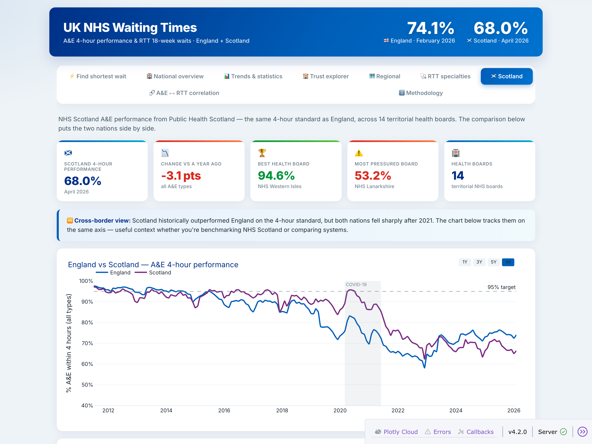

# UK NHS A&E and RTT Waiting Times — Analysis & Dashboard

### 🔗 [**Live demo →**](https://nhs-waiting-times.onrender.com)

[](https://nhs-waiting-times.onrender.com)

An end-to-end data project on the UK's published NHS waiting-time statistics —
**NHS England** (A&E + Referral-to-Treatment) and **NHS Scotland / Public Health
Scotland** (A&E by health board). It ingests the raw files into SQLite, runs
SQL + statistical analysis (seasonal decomposition, Mann-Kendall trend test,
correlation), and serves an interactive **Plotly Dash** dashboard — including a
**decision-support tool** that tells patients which providers are fastest and how
many weeks they could save, an **England-vs-Scotland** cross-border comparison, and
a generator for **SEO-friendly static pages** (e.g. *"ENT waiting times in London"*).

> *Analysed 5+ years of NHS England A&E and RTT waiting-time data across 237 trusts
> using Python and SQL, identifying a statistically significant decline in 4-hour
> performance (Mann-Kendall p < 0.001) and a positive trust-level correlation
> between emergency-flow and elective-waiting performance — deployed as an
> interactive Plotly Dash dashboard.*

---

## What's in it

| Layer | Tool | File |
|---|---|---|
| Ingestion | `requests` + `BeautifulSoup` | `scrape_nhs_data.py` (download raw files) |
| Storage | SQLite | `src/database.py`, `src/ingest.py` |
| Analysis | SQL + `pandas` | `src/analysis.py` |
| Statistics | `statsmodels`, `scipy`, `numpy` | `src/stats.py` |
| Visualisation | Plotly | `src/charts.py` |
| Decision support | SQL + `pandas` | `src/decision.py` |
| Dashboard | Dash | `app.py` |
| SEO pages | static HTML generator | `generate_seo_pages.py` |

**Data loaded:** 12,403 England trust-month A&E rows (237 trusts), 187 months of
England national A&E time series (Aug 2010–Feb 2026), 141,504 RTT incomplete-pathway
rows (by provider × specialty), and **NHS Scotland A&E across 14 health boards,
226 months back to 2007** (Public Health Scotland).

---

## Dashboard pages

1. **⚡ Find shortest wait (decision support)** — pick a specialty and region; get a
   plain-language recommendation, the fastest providers ranked with improving/
   worsening trend colours, each provider's percentile and % vs the national
   average, and the **weeks you could save** by switching. Turns the data into a tool.
2. **National overview** — 4-hour performance vs the 95% target with the COVID
   period shaded, attendance volumes, and headline KPI cards.
3. **Trends & statistics** — seasonal decomposition of the performance series,
   pre-COVID attendance seasonality, a pre/during/post-COVID comparison table,
   and the Mann-Kendall trend-test result.
4. **Trust explorer** — pick any trust; see its Type-1 performance vs the national
   line, monthly attendance volume, a 12-month data table, and the 15
   lowest-performing trusts.
5. **Regional** — a region × month heatmap and a latest-month ranking of the seven
   NHS England regions.
6. **RTT specialties** — national waiting-list size vs 18-week compliance, the worst
   specialties by 18-week breach, and a multi-select specialty trend explorer.
7. **🏴󠁧󠁢󠁳󠁣󠁴󠁿 Scotland** — NHS Scotland A&E performance with an **England-vs-Scotland**
   comparison, KPI cards, a 14-board ranking, a health-board explorer, and a
   board × month heatmap (Public Health Scotland data).
8. **A&E ↔ RTT correlation** — trust-level scatter of A&E 4-hour vs RTT 18-week
   performance with a fitted line and Pearson r / p-value.
9. **ℹ️ Methodology** — data source, last-refresh date, update frequency, what each
   metric means, and why a personal wait may differ from the published figure.

---

## Decision support & trends

The headline upgrade over a plain dashboard: instead of just *showing* "Provider A:
18 weeks", the tool **answers "what should I do?"**

- **Fastest nearby providers** — ranked shortest-wait-first within a chosen region.
- **Head-to-head comparison** — pick any two hospitals: *"Switching from B (17 weeks) to A (6 weeks) could save approximately 12 weeks."*
- **% difference from the national average** — is this provider better or worse, and by how much.
- **Estimated weeks saved by switching** — fastest provider vs the regional average.
- **Improving vs worsening** — every provider's 6-month median-wait trend (▼ improving / ▲ worsening).
- **Percentile ranking** — "faster than 92% of providers".
- **Trust indicators above the fold** — last refresh date, number of hospitals (152) and
  specialties (23), and the data source, so users see it's real, current NHS data.
- **Honest uncertainty** — a standing disclaimer that figures are estimates from RTT
  reporting and actual waits vary by clinical priority and individual circumstances.

All of this is built in `src/decision.py` and surfaced on the *Find shortest wait* tab.

---

## SEO static pages

Search engines index JavaScript single-page apps poorly, so `generate_seo_pages.py`
pre-renders **crawlable static HTML** — one page per specialty and per
specialty × region (≈136 pages), each with a unique `<title>`, meta description,
Open Graph tags, FAQ **JSON-LD structured data** (for rich results), a key-stats
table, and a link through to the live tool. It also emits `index.html`,
`sitemap.xml` and `robots.txt`.

```bash
python generate_seo_pages.py --base-url https://your-app.onrender.com
# -> seo_pages/ : ent-waiting-times-london.html, cardiology-waiting-times.html, ...
```

These target real search demand like *"cardiology waiting times in London"* or
*"NHS ENT waiting times"*.

---

## Quick start

```bash
# 1. install
python -m venv .venv && source .venv/bin/activate
pip install -r requirements.txt

# 2. (optional) download the raw NHS files — already present in data/raw/
python scrape_nhs_data.py

# 3. build the SQLite database from the raw files
python -m src.ingest            # add --no-rtt for a faster A&E-only build

# 4. run the dashboard
python app.py                   # http://127.0.0.1:8050

# 5. (optional) generate the SEO static pages
python generate_seo_pages.py --base-url https://your-app.onrender.com
```

---

## Key findings

- **4-hour A&E performance** fell from ~84% (2019) to the **low-to-mid 70s%** by
  2024–25 — a decline the **Mann-Kendall test confirms as statistically significant
  (z ≈ −10, p < 0.001)**, with Sen's slope ≈ −0.19 percentage points per month.
- **COVID-19** crashed April 2020 attendances by ~55% (to ~0.9m); performance
  briefly *rose* on the reduced footfall before deteriorating as activity returned.
- **Seasonality:** attendances peak in summer; winter brings the sharpest
  performance dips (the classic "winter pressures").
- **RTT backlog:** in the latest month several specialties — ENT, oral surgery,
  trauma & orthopaedics, gynaecology — have **only ~50% of patients seen within 18
  weeks**.
- **Cross-dataset:** across 124 trusts, A&E 4-hour and RTT 18-week performance are
  **positively correlated (r ≈ 0.37, p < 0.001)** — trusts that struggle on
  emergency flow tend to struggle on elective waits too.
- **England vs Scotland:** Scotland historically ran ~5–10 points ahead of England on
  the 4-hour standard (≈88% in 2019), but both nations fell sharply after 2021 and
  now sit in the **mid-to-high 60s%**. Within Scotland, island boards (Western Isles,
  Orkney) lead at 93–96% while mainland urban boards (Lanarkshire) trail near 53%.

*(Exact figures refresh automatically from whatever data is in the database.)*

---

## Deployment

The app exposes a gunicorn entrypoint (`app:server`) and ships with a `Procfile`,
so it deploys as-is to Render, Railway, or any Heroku-style host:

```bash
gunicorn app:server --bind 0.0.0.0:$PORT
```

Because the raw NHS files are large (the RTT set is ~360 MB) they are **git-ignored**.
For a hosted deploy, commit a pre-built `data/nhs_waiting.db` (a few MB) or run
`python -m src.ingest` as a build step.

---

## Project structure

```
nhs-waiting-times/
├── app.py                  Dash dashboard (gunicorn entrypoint: app:server)
├── scrape_nhs_data.py      Download raw A&E + RTT files from NHS England
├── generate_seo_pages.py   Build SEO static pages (seo_pages/)
├── src/
│   ├── database.py         SQLite schema + connection
│   ├── ingest.py           Parse raw files -> SQLite
│   ├── analysis.py         SQL-backed analysis functions
│   ├── decision.py         Decision support: fastest providers, trends, time saved
│   ├── stats.py            Mann-Kendall, seasonal decomposition, Pearson
│   └── charts.py           Plotly figure factories
├── notebooks/
│   └── analysis.ipynb      SQL + statistical walkthrough
├── assets/style.css        Dashboard styling (NHS palette)
├── data/raw/               Raw NHS files (git-ignored)
├── requirements.txt
└── Procfile
```

---

*Data source: [NHS England A&E waiting times](https://www.england.nhs.uk/statistics/statistical-work-areas/ae-waiting-times-and-activity/)
and [RTT waiting times](https://www.england.nhs.uk/statistics/statistical-work-areas/rtt-waiting-times/).
This project is for analysis/portfolio purposes and is not affiliated with NHS England.*
